# Booking Product 

With the help of booking products, customers can easily purchase and book everything online including Appointments, Events, Rentals, and table booking.

With this product type, the admin can manage all necessary details of the booking product, such as date available, slot period, stock value, price settings, and much more.

### How to Create Booking Products In Bagisto

**Step-1** Click on **Catalog >> Products  >> Select Booking** under Product Type as shown in the below image.

 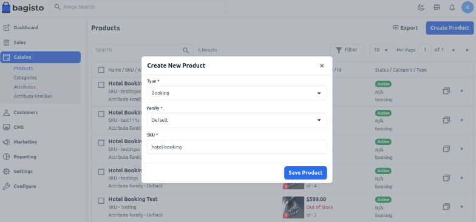

**Step-2** Select **Attribute Family >> enter SKU >> Click to Save Product** Now once you click on the **Save Product** button, you will be redirected to the next page where you will find several new settings 

**1) Name:** Enter the name of the product.

**2) URL Key:** This will be the end of the URL, for example, http://bagisto.test.com/products/set-of-men-casual-wear (set-of-men-casual-wear is a URL key)

**3) Tax Category:** You can select the Tax Category from the drop-down list that you want to apply to the product.

**4) Product Number:** Enter the product number

**5) Price:** Insert the price, cost, and special price, and set the special price date for which the special price will be shown on the website.

 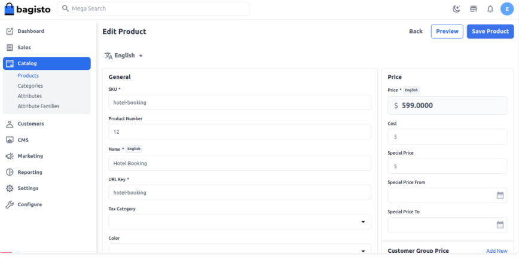

### Toggle Button

**New**

Enable the toggle button if you want to feature the product as a new product. The resulting product will be shown under the New Products section.

**Featured**

Enable the toggle button to show the product under the Featured Products section.

**Visible Individually**

Enable the toggle button to make the product visible on the front end.

**Status**

Enable the toggle button to enable the product on your eCommerce store.

**Guest Checkout**

Enable the toggle button to allow the product to be ordered by guest customers. 

   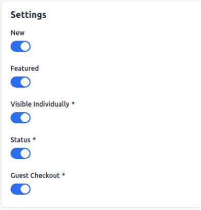

### Short Description

Enter a short description of the features of the product.

### Description

Mention your product in detail.

   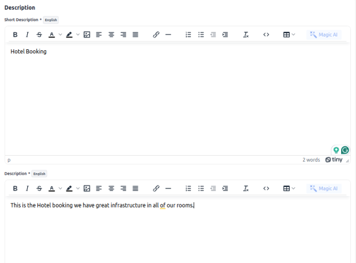

**Meta Title**

Provide the main title of the product by which your product will be known.

**Meta Keyword**

The meta keyword for the product needs to be provided to improve its searchability on the search engine for specific keywords.

**Meta Description**

Enter the description so that products can easily appear in search engine listings.

   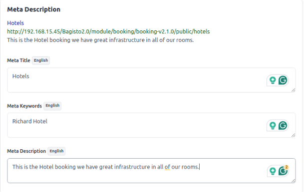

### Images

To add the product images, click on Add Images. You can add multiple images for your product.   

   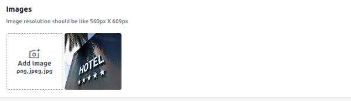

### Booking Information

To create the Booking Product, select the Booking type as per choice. There are 5 below types of booking products. Let’s discuss “How to create Booking Products in Bagisto” one by one.

1) Default

2) Appointment Booking

3) Event Booking

4) Rental Booking

5) Table Booking

**Default Booking Product:-**

The admin can create a Default booking product as shown below in the screenshot. In default booking products there are two types.   

   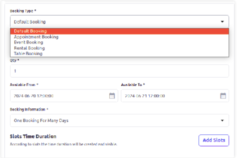

**A) One Booking for Many days**

**B) Many Booking for One Day**

To create the many bookings for one day, configure the below booking detail.

**1) Location:-** Enter the location for booking products.

**2) Quantity:-** Enter the quantity of booking products. This is the global quantity for each slot.

**3) Available From:-** Select the start date for the booking.

**4) Available To:-** Select the end date for the booking.

**5) Type:-** Select the type of booking, Many bookings for one day or One booking for many days.

**6) Slot Duration(Mins):-** Set slot duration in a minute. By default, it is 45 min.

**7) Break Time b/w Slots(Mins):-** Set the break time between slots in min. By default, it is 15 min.

   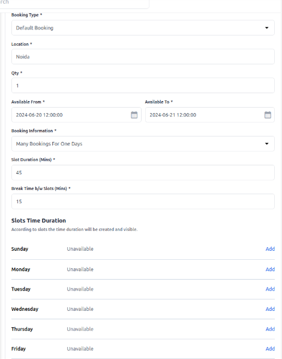

**Add Slots**

Click on **Add** icon and add the timing slots and status and then click on **Save** as shown in the below image.   

   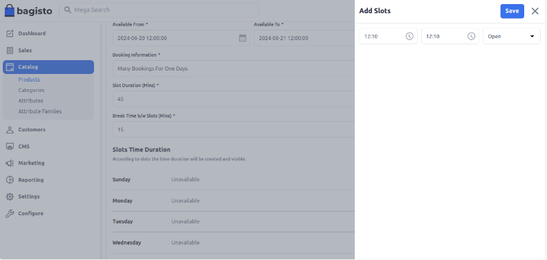

Slots have been added for Sunday in the below image.

   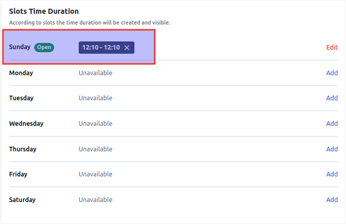

At last click on the **Save Product** button.

### Front End

Here, you need to first select the **date** for which you want the booking. After that, you need to select the **required slot**. You can also view the location on google map.

   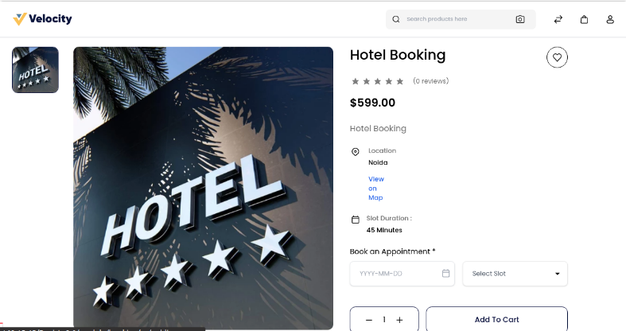

### One Booking For Many Days

To create the one bookings for many day, configure the below booking detail.

**1) From Day:-** Select the From day for the booking.

**2) To Day:-** Select the To day for the booking.

**3) From Time:-** Select the From time of the booking.

**4) To Time:-** Select the To time of the booking.

   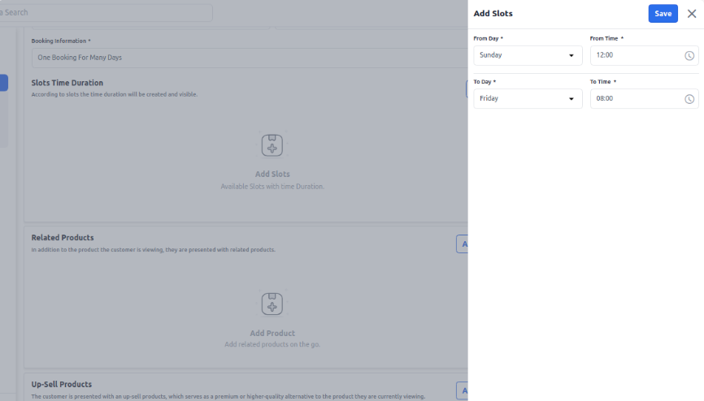

Slot Duration is booked for One booking for many days as shown in the below image.

   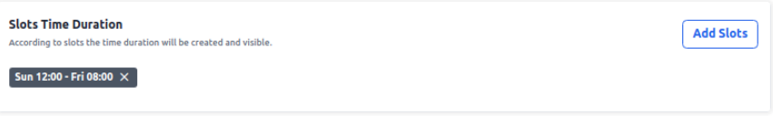

### Front End

Here, you need to first select the date for which you want the booking. After that, you need to select the required slot. You can also view the location on google map.

   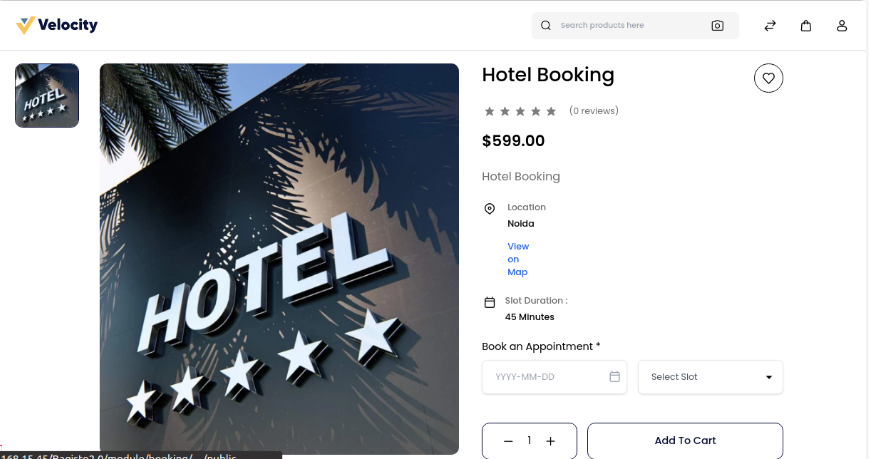

### Appointment Booking:-

The admin can create an Appointment booking product as shown below in the screenshot. Here Admin has to select the Appointment Booking type.

   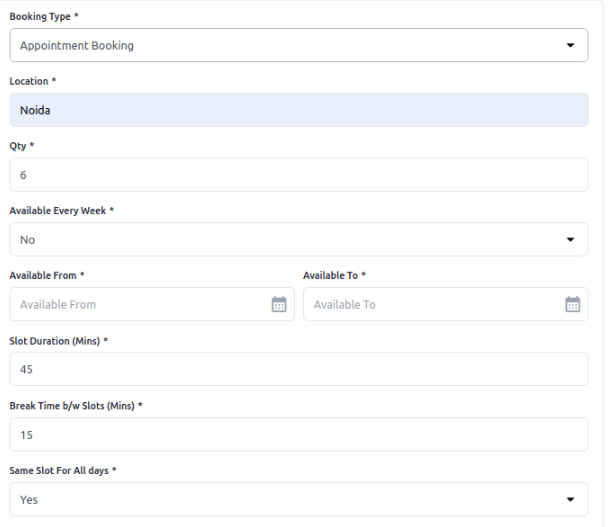

**1) Location:-** Enter the location for Appointment booking products.

**2) Quantity:-** Enter the quantity of booking products. This is the global quantity for each slot.

**3) Available Every Week:-** Set **“Yes”** to configure time slots for all days of the week. if you don’t want to configure the time slots for all the days of the week set **“No“**. And configure the start date and end date.

**4) Slot Duration(Mins):-** Set slot duration in a minute. By default, it is **45 min**.

**5) Break Time b/w Slots(Mins):-** Set the break time between slots in min. By default, it is **15 min**.

**6) Same Slot All Days:-** Set **“Yes”** for the same slot for all the days add **from** and **to** timings check the below image for reference.

  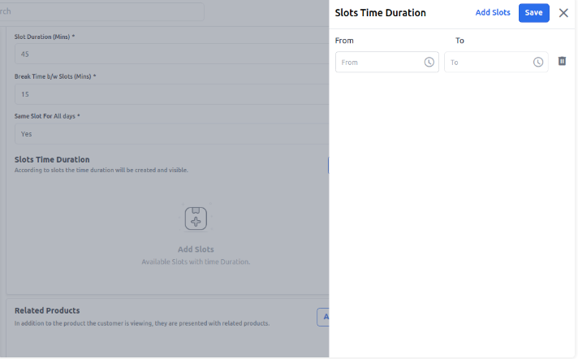

Else set **“No”**  for the different slots for each day add **from** and **to** timings according to the days check the below image for reference.  

   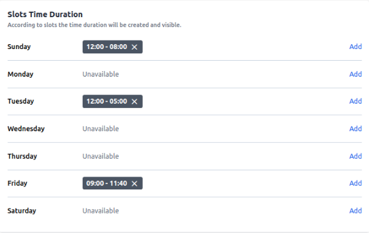

### Front End 

   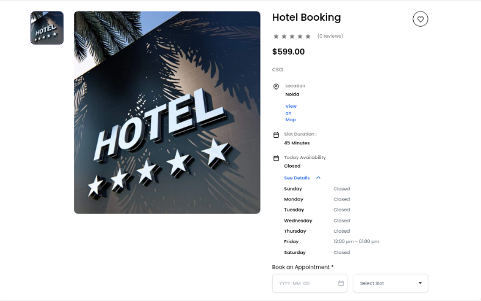

### Event Booking:-

The Admin can create an **Event booking** product as shown below in the screenshot. Here Admin has to select the Event Booking type.

**1) Location:-** Enter the location for Event booking products.

**2) Available From:-** Select the start date fo the booking.

**3) Available To:-** Select the end date for the booking.   

   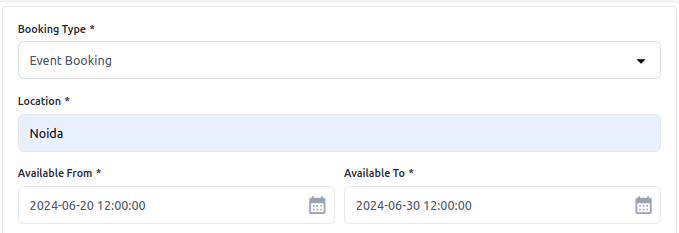

**Renting Type:-** There are three Renting Type

**a) Daily Basis:-** If you have selected the “Renting Type” as a Daily Basis. Then set the per day rent then click on save product.

   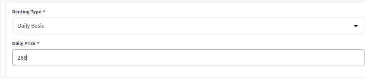

**b) Hourly Basis:–** If you have selected the “Renting Type” as Hourly Basis. Then configure the below booking detail.   

   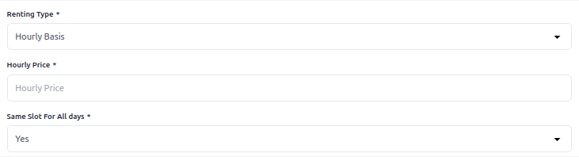

**c) Both(Daily and Hourly Basis):-** If you have selected the “Renting Type” as both ((Daily and Hourly Basis). Then configure the details as above like daily price, hourly price, and same slot on all days then click on Save Product.   

   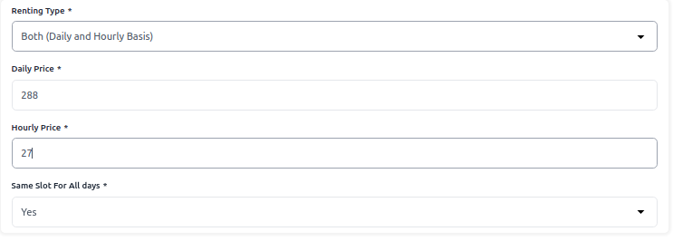

### Front End

Here customer has to select the option to choose the Rent option either Daily Basis or Hourly Basis (if this is already configured in the backend).

   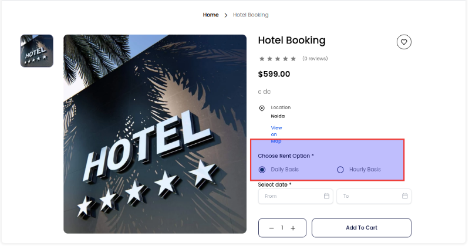

### Table Booking:-

The admin can create a Table booking product as shown below in the screenshot. Here Admin has to select the Table Booking type.

   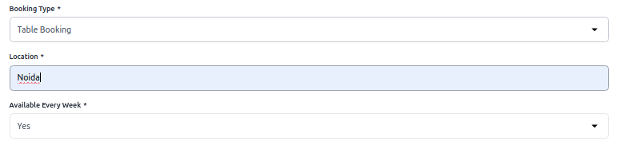

Now Configure the below Table booking detail.

**1) Location:-** Enter the location for Table booking products.

**2) Available Every Week:-** Set “Yes” for configure time slots for all days of the week..if you don’t want to configure the time slots for all the days of the week set “No“. And configure the start date and end date.

**3) Charged Per:-** You can charge a basis like the per table or per guest. When you select per table then you have to enter Guest Limit Per Table. So that you can charge per table(2 guests) below screenshot.

**4) Guest Capacity:-** Set the maximum number of guests the table can be booked for.

**5) Slot Duration (Mins):-** Set slot duration in a minute. By default, it is 45 min.

**6) Break Time b/w Slots(Mins):-** Set the break time between slots in min. By default, it is 15 min.

**7) Prevent Scheduling Before:-** the minutes to advance booking means that before the start time of the slot.

**8) Same Slot All Days:-** Set “Yes” for the same slot for all the days.

   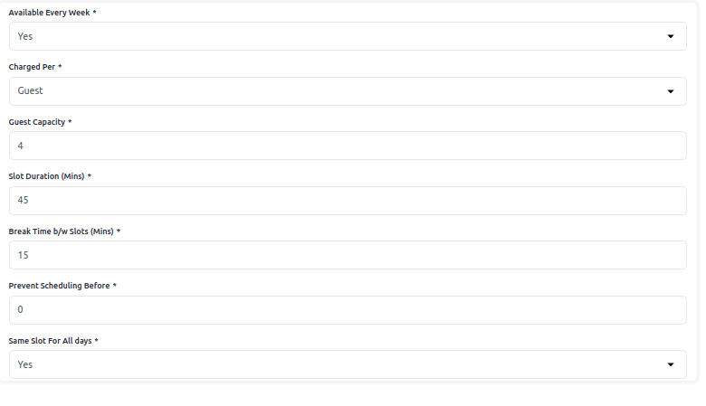

Else set **“No”**  for the different slots for each day.

   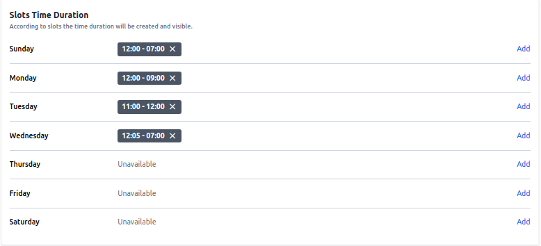

### Front End:-

Here customer has to select the date and time and add a note for admin.

   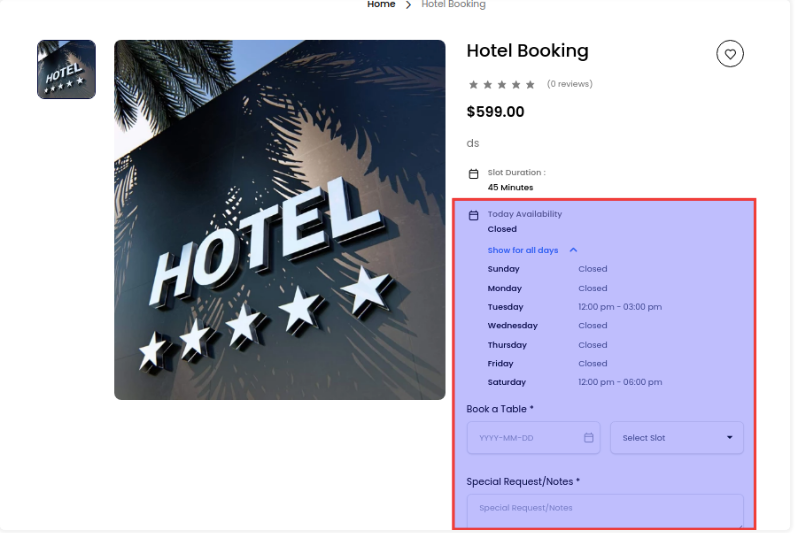

### Admin Panel

After placing the order login to the admin panel of bagisto

Click on **Sales >> Booking Product** and you will able to see the ordered product in the booking product datagrid also you can see the calender view of your booking for this click on **Calender button** as shown in the below image.   

   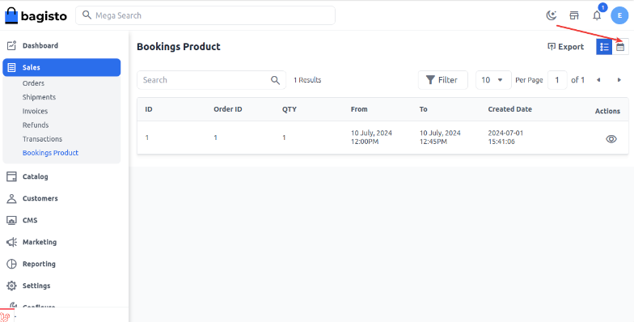

### Calender View

The ordered slot is booked in the calender view as shown in the below image.

   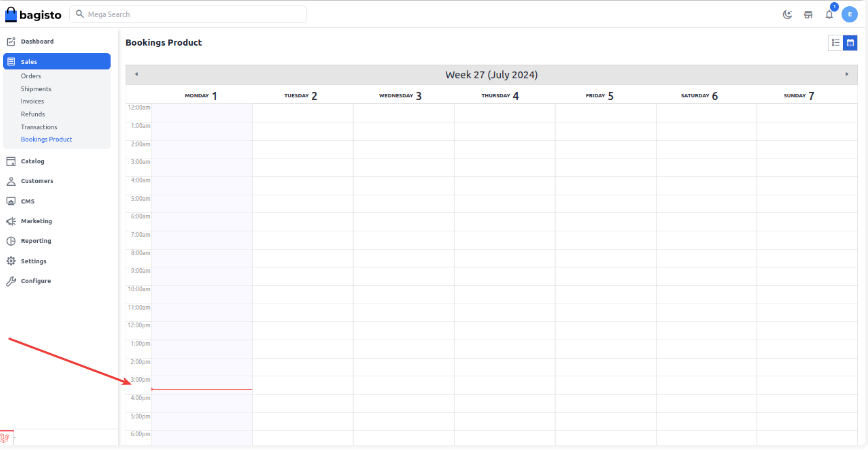

**NOTE:- The booking product type is not set by default; it needs to be installed**

