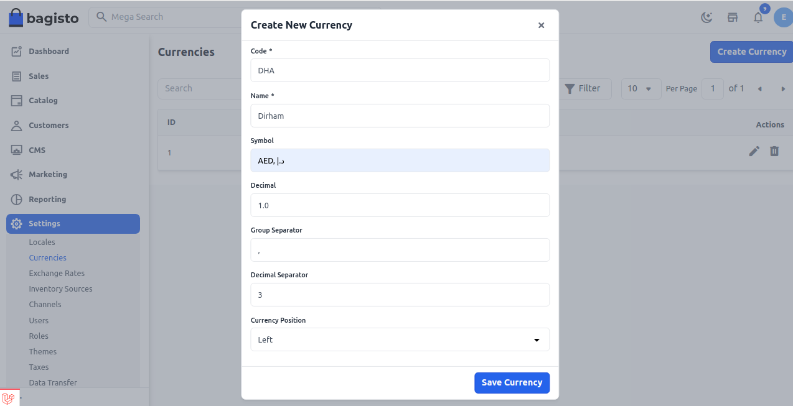
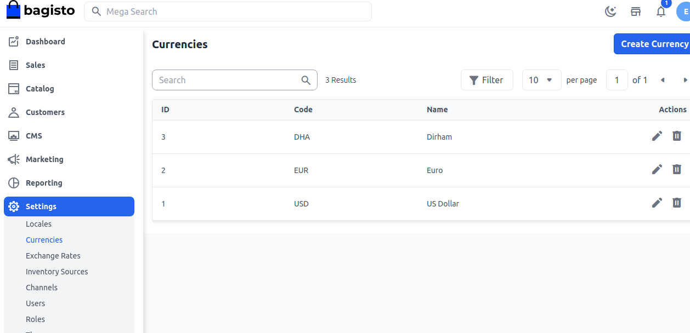
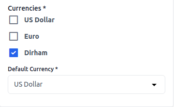

# Currencies

Before launching your eCommerce website you need to set up the currency in which you will doing your business. Currency symbol will be visible in product prices, order, invoices, transactions etc. Here we have mentioned steps on how to add currency in bagisto.

### Add Currency in Bagisto

**Step 1:** On the Admin panel of Bagisto go to **Setting >> Currencies >> Create Currency** as shown in below image.

**Step 2:** Now Enter the below details 

**1) Code-** Code of the currency.

**2) Name-** Name of the currecy. 

**3) Symbol-** Symbol of the currency.

**4) Decimal-** Decimal of the currency

**5) Group Seprator-** It helps to separate the currency by ",". For example - 2,50,000

**6) Decimal Separator-** It helps to separate decimal values.  For example, if you enter 3 decimal values then the currency will be 200.000

**7) Position-** It helps to position the currency left, right etc. 

**Step 3:** Now you will able to see the new **Currency** by the name of **Dirham** as shown below.

### Channel Setting For Currency

On the admin panel open **Settings >> Channels** you will able to see Currency section and you new currency right there.

Once the channel setting has been done click on **Save Channel** as shown in below image.

So by this you can easily create a **Currency** in Bagisto. 