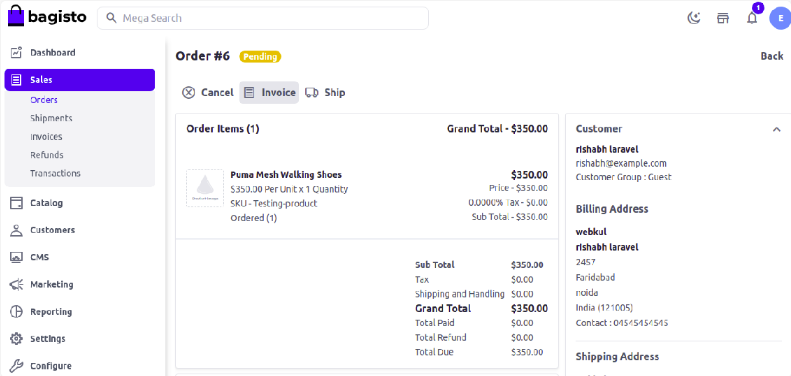
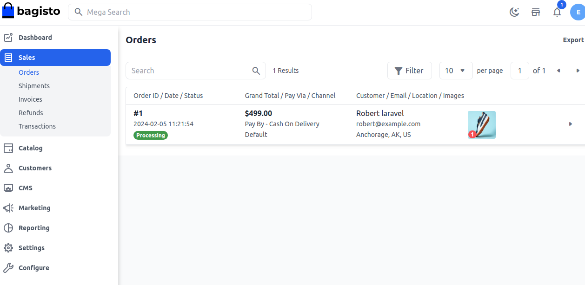

# Create Invoice

From here, you can generate the invoice for the order and confirm the customer’s order by clicking on the **Invoice**. Admin can check the details enter the quantity to invoice then click Invoice.

Invoice is used to confirm an e-commerce transaction and provide a detailed order confirmation to customers. That said, some business-to-business merchants may offer credit—the order will be placed first and the invoice will be sent later to ask for payment

Itemized commercial document that records the products or services delivered to the customer, the total amount due, and the preferred payment method. The seller can send either paper or electronic invoices to the customer.It is a document that is used to record a transaction between a buyer and a seller. It contains information about the item and its price, tax charges associated with it, etc.

 

 After creating an Invoice order status automatically goes from **Pending** to **Processing**

  

By following the above steps, you can easily create a **Invoice** in Bagisto.