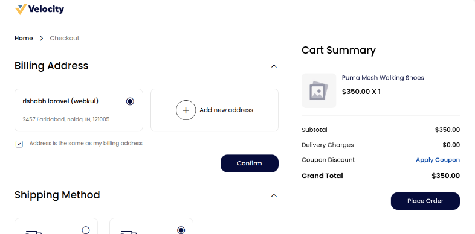
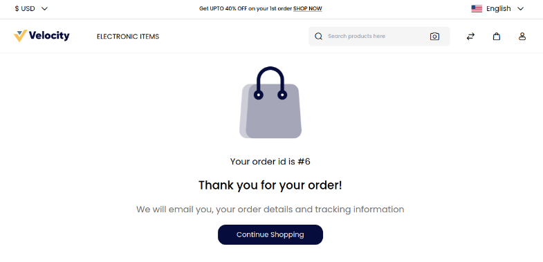
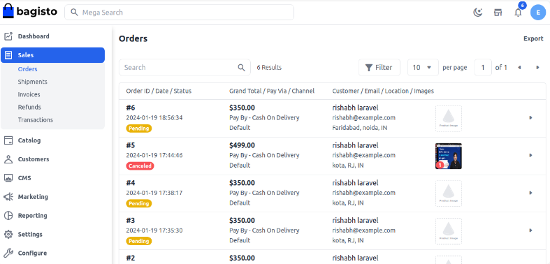

# Create Orders

The order is created when a customer goes to your website, selects some product, and then places a request for it. Here we are going to discuss how to manage orders in Bagisto.

When a customer places an order from the front end, on the admin panel, the order status is generated from where the admin can further process the order.

### How to Manage Orders in Bagisto2.0

**Adding Products in Cart**
Go to the product page Add your desired product and click on **Place Order** as shown in the below image.

   

After clicking on Place Order, the next page will open like below then you will get an Order ID.

 

**Customer Panel**

On the customer dashboard, customers can see all order history with order status. Customers can also cancel the order as shown in the below image.

**Information**

On the Information Page, the Admin can check customer details like name, address, quantity, etc. Admin can also cancel the order.

 

 **Note:- The cancel button will be visible when the order status is pending.**

 By following the above steps, you can easily create a Order in Bagisto.

