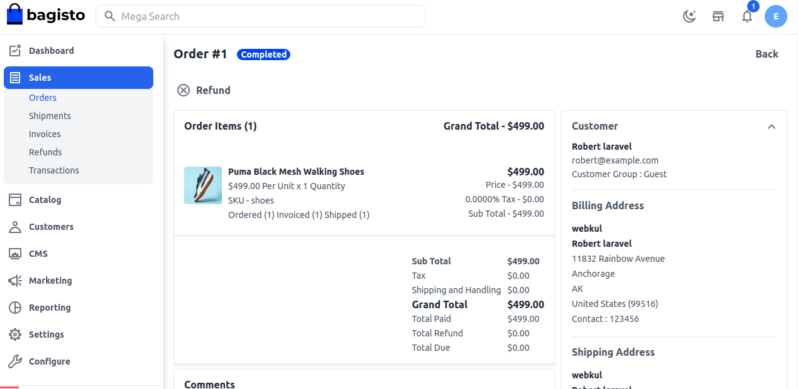
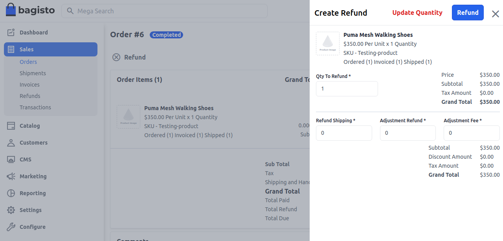
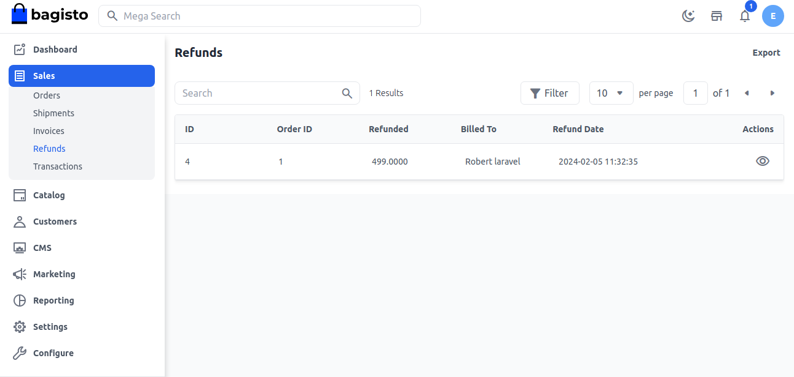

# Refunds

Typically, ecommerce stores offer a 15- to 30-days in which customers can return a product and ask for a refund. Some businesses extend that period up to 90 days. Regardless of the time frame you choose, ensuring that you actually have a time frame is essential.

A customer who bought an item may ask the store for their money back if it didn't fit according to their choice.you may ask for them to return your money.

In Bagisto after your order is **Completed** after creating a shipment you go and edit that order and from there you can easily apply for a refund.

   

So now enter the quantity which you wanted to apply a refund for and enter the other fields as per your requirements and after click on **Refund** button as shown in below image.

   

After that it will get redirected to the **Refund Grid** and show the refunded amount in the grid as shown in below image

And now to check the results you can go to **Sales >> Orders** will able to see an order status is **Closed** now as shown in below image.

  

By the above steps you can easily Refund in Bagisto.  

