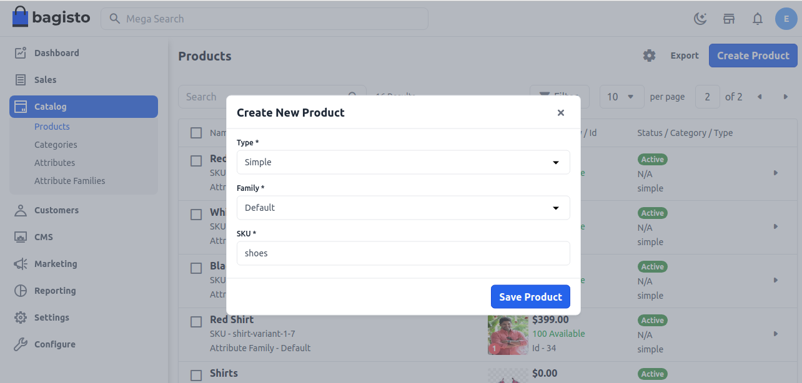

# Simple Product

A **simple product** is a product type in e-commerce that does not require customers to choose additional attributes (such as size or color) to add to the cart. It should be a physical item and can be shipped to customers.

Therefore, any service, such as downloadable items, does not count as a simple product. This is the step-by-step tutorial on how to add a simple product in [Bagisto](https://bagisto.com/en/).

### Create Simple Product in Bagisto 2.0
1. Click on **Catalog >> Products >>** select **Simple** under Product Type.

    

Now **Save the Product**, and you will get redirected to the Edit product page as shown below.

### General Attributes
Below is the list of fields you need to fill under General Attributes.

   

### Description
Below is the list of the fields you need to fill in regarding the product under description.

#### Short Description
Enter a short description of the feature of the product.

#### Description
Mention your product in detail.

 

### Meta Description
Below is the list of fields that you need to provide under the meta description to make your product easily searchable on search engines.

#### Meta Title
Provide the main title of the product by which your product will be known.

#### Meta Keyword
The meta keyword for the product needs to be provided to improve its searchability on the search engine for specific keywords.

#### Meta Description
Enter the description so that products can easily appear in search engine listings.

### Images
To add the product images, click on **Add Images**. You can add multiple images for your product.

### New
Enable the toggle button if you want to feature the product as a new product. The resulting product will be shown under the New Products section.

### Featured
Enable the toggle button if you want to show the product under the Featured Products section.

### Visible Individually
Enable the toggle button so that the product will be visible on the front end.

### Status
Enable the toggle button to enable the product on your eCommerce store.

### Guest Checkout
Enable the toggle button to allow the product to be ordered by guest customers.

### Price
Insert the price, cost, and special price, and set the special price date for which the special price will be shown on the website.

### Shipping
Set the Width, Height, Depth, and Weight of the product.

### Inventories
Insert the quantity of the product that is there in your inventory. By default, it is set to 0 so it shows on the front end as out of stock.

At last, **Save the Product**.

### Front End
The product will be visible as given below on the front end.

